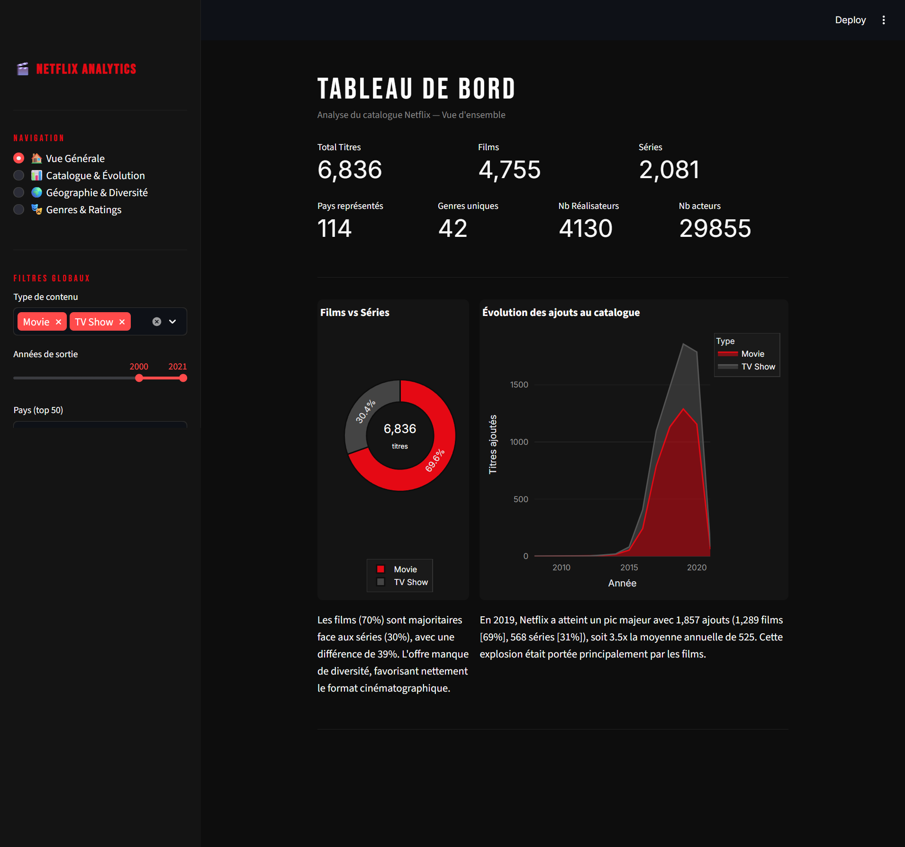
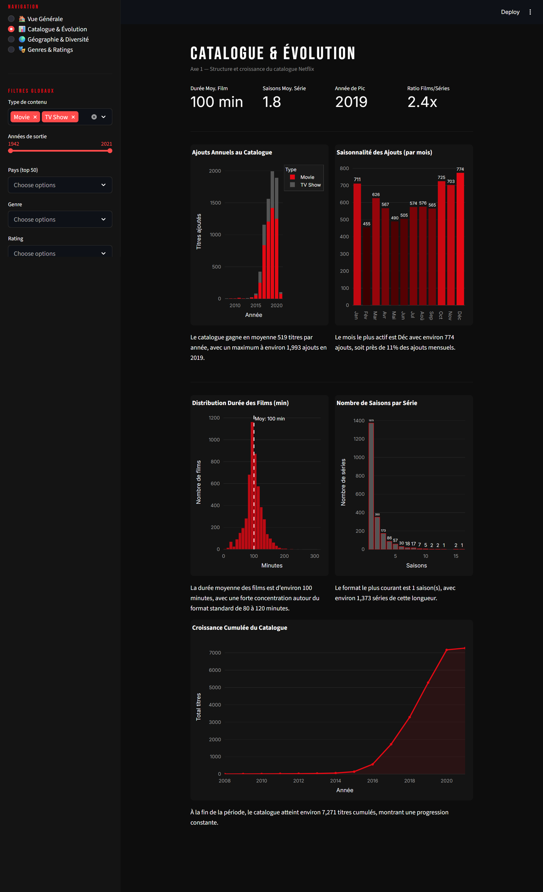
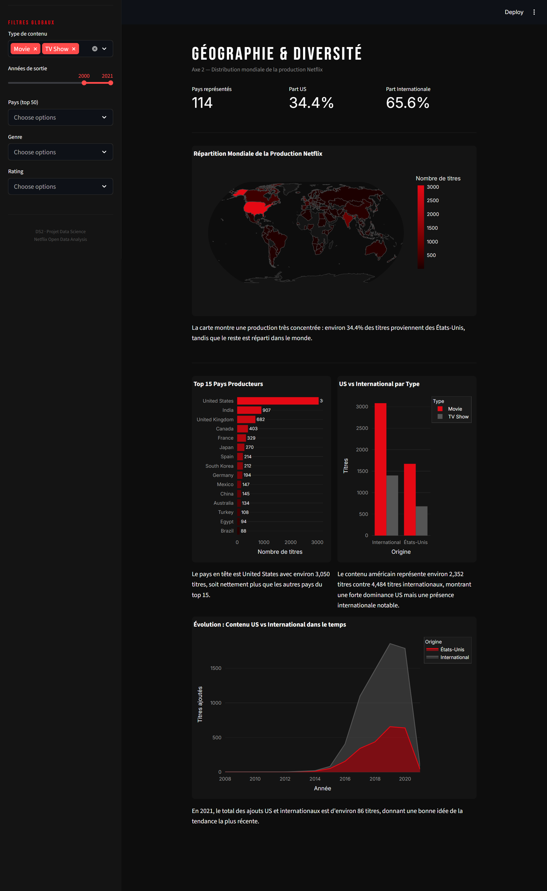
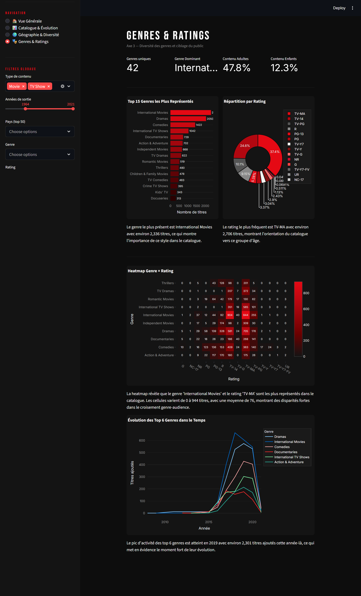

# 🎬 Netflix Analytics Dashboard

  
  
  
  
  

---

## 📌 Présentation du projet

**Netflix Analytics Dashboard** est une application interactive de data visualisation construite avec **Python**, **Streamlit** et **Plotly**. Elle permet d'explorer en profondeur le catalogue Netflix à travers **4 axes d'analyse**, avec des filtres dynamiques, des graphiques interactifs et des insights automatisés.

---

 
## 🖼️ Aperçu des pages
 
### 🏠 Vue Générale — KPIs globaux, répartition Films/Séries, évolution des ajouts

 
---
 
### 📊 Catalogue & Évolution — Ajouts annuels, saisonnalité, durées, croissance cumulée

 
---
 
### 🌍 Géographie & Diversité — Carte mondiale, top pays producteurs, US vs International

 
---
 
### 🎭 Genres & Ratings — Top genres, répartition ratings, heatmap, évolution temporelle

 

---

## 🔧 Fonctionnalités

### 🧹 Prétraitement des données
- Conversion des dates au format `datetime`
- Extraction de l'année et du mois d'ajout
- Imputation des valeurs manquantes (`director`, `cast`, `rating`)
- Nettoyage et explosion des colonnes multi-valeurs (`country`, `genres`, `cast`)

### 🎛️ Filtres globaux interactifs (sidebar)
- **Type de contenu** : Film / Série (multi-sélection)
- **Années de sortie** : Curseur dynamique (min/max auto)
- **Pays** : Top 50 pays producteurs
- **Genre** : Tous les genres disponibles
- **Rating** : Tous les ratings disponibles

### 📄 Pages d'analyse

#### 🏠 Vue Générale
- KPIs : Total titres, Films, Séries, Pays, Genres, Réalisateurs, Acteurs
- Donut chart Films vs Séries avec annotation centrale
- Graphique d'évolution des ajouts au fil des années (area chart)
- Commentaires analytiques automatisés selon les données filtrées

#### 📊 Catalogue & Évolution
- Ajouts annuels empilés par type (bar chart)
- Saisonnalité mensuelle (bar chart avec gradient)
- Distribution des durées des films (histogramme + ligne de moyenne)
- Nombre de saisons par série (bar chart)
- Croissance cumulée du catalogue (area chart)

#### 🌍 Géographie & Diversité
- KPIs : Pays représentés, Part US, Part Internationale
- Carte choroplèthe mondiale (Plotly choropleth)
- Top 15 pays producteurs (bar chart horizontal)
- US vs International par type (bar chart groupé)
- Évolution temporelle US vs International (area chart)

#### 🎭 Genres & Ratings
- KPIs : Genres uniques, Genre dominant, Contenu adultes, Contenu enfants
- Top 15 genres (bar chart horizontal avec gradient)
- Répartition par rating (donut chart)
- Heatmap Genre × Rating (avec valeurs annotées)
- Évolution des top 6 genres dans le temps (line chart)

---

## 💡 Key Insights — Analyse des données

> Basés sur le dataset complet (7 271 titres après nettoyage, années de sortie filtrées 2000–2021).

### 📊 Structure du catalogue
- Le catalogue contient **6 836 titres** : **4 755 films (70%)** et **2 081 séries (30%)**.
- Le ratio Films/Séries est de **2,4x**, révélant une offre nettement orientée vers le cinéma plutôt que les productions sérielles.
- On recense **4 130 réalisateurs** distincts et **29 855 acteurs** uniques, témoignant d'une industrie très fragmentée.

### 📅 Évolution temporelle
- Netflix a connu une **explosion de son catalogue à partir de 2015**, avec une croissance quasi-exponentielle jusqu'en 2019.
- **2019 est l'année de pic** avec **1 857 ajouts** (1 289 films + 568 séries), soit **3,5× la moyenne annuelle** de 525 titres.
- Après 2019, une baisse notable est observée, probablement liée à un **recentrage stratégique** et aux effets de la pandémie sur la production.
- **Décembre** est le mois le plus actif avec **774 ajouts (~11% des ajouts annuels)**, suggérant une stratégie de renforcement de l'offre avant les fêtes.

### 🌍 Géographie & Diversité
- Bien que Netflix soit présent dans **114 pays**, la production reste très concentrée : **34,4% des titres proviennent des États-Unis**.
- Les **États-Unis dominent** largement avec **3 050 titres**, suivis de l'**Inde (907)**, du **Royaume-Uni (682)** et du **Canada (403)**.
- La part **internationale (65,6%)** dépasse les États-Unis en volume cumulé, portée notamment par l'Inde, le Royaume-Uni et la France (329 titres).
- L'internationalisation s'est fortement accélérée après 2015, avec une montée en puissance des contenus non-américains.

### 🎭 Genres & Ratings
- **"International Movies"** est le genre le plus représenté avec **2 336 titres**, reflétant la stratégie de Netflix de capitaliser sur les productions locales à l'international.
- Les **Dramas (2 056)** et les **Comedies (1 422)** complètent le podium des genres les plus populaires.
- Le rating **TV-MA (37,4%)** domine, ce qui signifie que le catalogue est majoritairement orienté **adultes** (47,8% de contenu adulte au total).
- Le contenu **enfants/famille** ne représente que **12,3%** du catalogue — une niche sous-représentée.
- La **heatmap Genre × Rating** révèle que l'"International Movies" en TV-MA atteint **944 titres**, la cellule la plus dense du catalogue.

### 🎬 Format des contenus
- La **durée moyenne des films est de 100 minutes**, avec une forte concentration entre 80 et 120 minutes — le format cinématographique standard.
- Pour les séries, le format **1 saison** est de loin le plus courant (**1 373 séries**), indiquant une préférence pour les mini-séries ou les anthologies.

---
## Réalisé par:
Hiba Kourda & Farah Gritli

